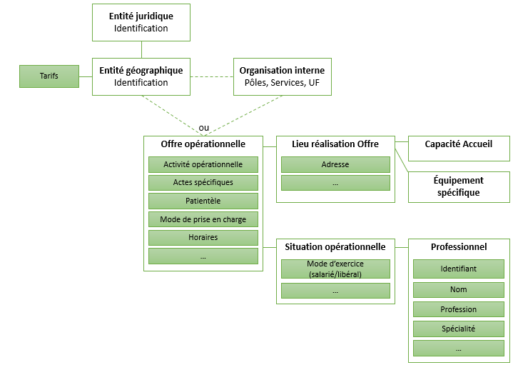

# Accueil - Répertoire national de l’Offre et des Ressources en santé et accompagnement médico-social v0.7.0

## Accueil

 
There is no translation page available for the current page, so it has been rendered in the default language 

 **Brief description of this Implementation Guide**
 The French directory of healthcare and medico-social support services and resources ([ROR](https://esante.gouv.fr/produits-services/repertoire-ror)) is the repository (in the sense of a repository of data) for describing the healthcare services offered by Health facility, medico-social establishments and services, and local structures in France. The aim of this implementation guide is to define the specifications of the ROR FHIR API, enabling any authorized application to search for a healthcare offer and its capabilities (availability, equipment, etc.). 

### Informations sur ce guide d'implémentation

**Ce Guide d'Implémentation FHIR du ROR se référence au modèle d`exposition 3.0.1 du ROR. 
 Cette version du guide d’implementation cible l’implémentation de l’API FHIR dans la solution du ROR National version 5.1.**

Dans ce guide vous pourrez retrouver des indicateurs afin d'identifier la maturité de certains éléments ou certaines sections de la manière suivante :

* `deprecated` => correspond à ce qui ne sera bientôt plus disponible dans la solution ROR National
* `draft` => correspond à ce qui est en cours d'implémentation dans la solution ROR National et donc pas encore validé et disponible. L'objectif de cet indicateur est de donner de la visibilité sur ce qui est en cours d'implémentation dans la solution ROR National.
* `under consideration` => correspond à ce qui est en cours de réflexion dans la solution ROR National. L'objectif de cet indicateur est de donner de la visibilité sur ce qui est à l'étude pour les prochaines versions du ROR National.

Les autres éléments ou section qui n'ont pas ces mentions doivent être implémentés et disponibles dans la version courante de la solution du ROR National.

Pour plus d'information sur les versions de l'Implementation Guide n'hésitez pas à consulter [l'Historique](https://interop.esante.gouv.fr/ig/fhir/ror/history.html) Si vous avez des questions ou des suggestions concernant ce guide vous pouvez nous les adresser [ici](https://github.com/ansforge/IG-fhir-repertoire-offre-ressources-sante/issues/new/choose).

### Description fonctionnelle de l'API

#### Le ROR, référentiel de données de description de l'offre de santé

##### Le référentiel ROR

Le Répertoire de l'Offre et des Ressources en santé et accompagnement médico-social ([ROR](https://esante.gouv.fr/produits-services/repertoire-ror)) est le référentiel (au sens gisement de données) de description de l'offre de santé des établissements sanitaires, des établissements et services du médico-social et des structures de ville.

Les acteurs de santé ont convergé sur une vision commune de l'offre de santé. L'offre de santé est définie par une ou plusieurs activités opérationnelles, réalisée(s) dans le cadre d'un mode de prise en charge et pour une patientèle, et par les ressources qui permettent la réalisation de ces activités opérationnelles sur un lieu donné. Ces ressources concernent principalement les équipements spécifiques, les capacités d'accueil et les compétences que l'on souhaite identifier pour cette offre.

* **Référentiel ROR**: 

Le ROR, en tant que référentiel de description de l'offre de santé (au sens gisement de données), a une couverture nationale. Il doit permettre à toute application autorisée de rechercher une offre de santé.

##### Instances des ROR régionaux

Dans les faits, chaque région met en œuvre, alimente et exploite une partie du référentiel limité à une couverture régionale, sans intersection de périmètre entre les régions. Chaque région est maîtresse de la solution technique qu'elle met en œuvre.

Les solutions techniques sont qualifiées de « solution ROR ». Deux solutions ROR sont déployées sur le territoire : ROR IR et ROR IeSS.

L'instance régionale de la solution ROR mise en œuvre dans une région, et alimentée de la description de l'offre de santé de la région est appelée « ROR régional ».

Chaque ROR régional propose à ses utilisateurs un écran de recherche de l'offre régionale, et permet une recherche d'offre dans les autres régions. Historiquement, cette recherche d'une offre au-delà de la région s'appuie sur des services proposés par chaque ROR régional, et nécessite que chaque instance régionale soit interconnectée avec les instances des 17 autres régions.

##### Instance du ROR national

Dans un contexte de sollicitation croissante des ROR régionaux, la nécessité d'améliorer la qualité du service rendu aux utilisateurs et le vieillissement technologique des solutions logicielles ROR rendent indispensable une évolution des logiciels et de leur architecture. Pour répondre à ce besoin, il a été décidé collectivement en 2020 de construire une solution logicielle ROR unique, avec un stockage centralisé des données (base de données unique) qui remplacera à terme les solutions ROR régionales.

La construction du ROR nationale est réalisée par étape. Lors des deux premières étapes, le ROR national est alimenté par les ROR régionaux.

La mise en œuvre du ROR national et de son webservice de recherche permet de centraliser la recherche auprès du ROR national en remplacement des différentes instances régionales.

Ce service peut ainsi permettre à une instance régionale de s'appuyer sur le ROR national pour réaliser l’équivalent d’une « recherche interROR », et permet également aux autres systèmes consommateurs des données du ROR de disposer d'un service pour lancer une recherche et obtenir en résultat la description des offres de santé recherchées.

Ce webservice, basée sur le modèle d'exposition V3 au format FHIR, permet aux systèmes consommateurs de réaliser une recherche sur les informations capacitaires en lits/places, sous réserve de disposer des droits d'accès adaptés.

#### Modélisation

##### Données utilisées pour la modélisation UML

Les attributs de description de l'offre, fournis en résultat d'une recherche, sont décrits dans le document ROR-modèle d'exposition. Ces attributs sont décrits en utilisant la norme UML et en cohérence avec le Modèle des Objets de Santé (MOS) et les nomenclatures associées (NOS) gérés par l'ANS.

Ces attributs sont associés à des règles de gestion communes qui sont également présentées dans le document ROR-modèle d'exposition [[Ref_01]](https://esante.gouv.fr/sites/default/files/media/document/ROR_ME_V3.0.1_ModeleExposition_VFD_20260316.pdf).

##### Nomenclatures

La capacité à échanger de l'information entre les ROR et les systèmes consommateurs repose sur l'interopérabilité sémantique et syntaxique des deux systèmes. On entend par « sémantique » à la fois la signification des mots et le rapport entre le sens des mots (homonymie, synonymie, etc.). Assurer l'interopérabilité des échanges nécessite donc que chacun de ces systèmes puisse interpréter la signification de l'information reçue et utiliser cette information en correspondance sémantique avec ses données locales.

Cet objectif conduit à mettre en œuvre des nomenclatures (terminologies de référence et jeux de valeurs) qui permettent de renseigner les concepts du modèle d'exposition et qui font le lien avec les concepts des modèles des ROR régionaux. Ces nomenclatures d'échange sont précisées dans le document de référence ROR-modèle d'exposition [[Ref_01]](https://esante.gouv.fr/sites/default/files/media/document/ROR_ME_V3.0.1_ModeleExposition_VFD_20260316.pdf).

Chaque nomenclature des outils interopérables doit trouver son équivalence dans la nomenclature du concept associé dans le modèle d'exposition.

Les systèmes consommateurs du web service du ROR national doivent pouvoir intégrer les évolutions régulières des nomenclatures (ajout de code, modification de libellé, mise en obsolescence d'un code, réactivation de code).

##### Ressources profilées

La liste ci-dessous expose la liste des profils génériques profilés.

| | |
| :--- | :--- |
| Titre du profil | Description |
| [RORHealthcareService](StructureDefinition-ror-healthcareservice.md) | Profil créé dans le cadre du ROR pour décrire les prestations que peut réaliser une structure et qui permettent de répondre au besoin de santé d'une personne |
| [RORLaunchContextExtension](StructureDefinition-ror-launchcontext.md) | Profil de l'extension http://hl7.org/fhir/uv/sdc/StructureDefinition-sdc-questionnaire-launchContext.html créé dans le cadre du ROR afin d'ajouter le name 'structure' acceptant les ressources FHIR 'Organization', 'HealthcareService' et 'Location' |
| [RORLocation](StructureDefinition-ror-location.md) | Profil créé dans le cadre du ROR pour décrire l'espace disposant d'un ensemble de ressources pour réaliser une offre. |
| [ROROrganization](StructureDefinition-ror-organization.md) | Profil créé dans le cadre du ROR pour décrire les organismes du domaine sanitaire, médico-social et social immatriculés dans le FINESS et les organisations internes |
| [RORPractitioner](StructureDefinition-ror-practitioner.md) | Profil créée dans le cadre du ROR pour décrire les données d'identification pérennes d’une personne physique, qui travaille en tant que professionnel |
| [RORPractitionerRole](StructureDefinition-ror-practitionerrole.md) | Profil créé dans le cadre du ROR pour décrire les modalités d'exercice opérationnelles du profesionnel dans la réalisation de l'offre |

#### Dépendances

#### Propriété intellectuelle

Certaines ressources sémantiques de ce guide sont protégées par des droits de propriété intellectuelle couverte par les déclarations ci-dessous. L’utilisation de ces ressources est soumise à l’acceptation et au respect des conditions précisées dans la licence d’utilisation de chacune d’entre elle.

* This material derives from the HL7 Terminology (THO). THO is copyright ©1989+ Health Level Seven International and is made available under the CC0 designation. For more licensing information see: [https://terminology.hl7.org/license.html](https://terminology.hl7.org/license.html)

* [UsageContextType](http://terminology.hl7.org/7.2.0/CodeSystem-usage-context-type.html): [RORQuestionnaire](StructureDefinition-ror-questionnaire-healthcareservice.md) and [RORUsageContextTypeVS](ValueSet-ror-usage-context-type-vs.md)

#### Documents de référence

* [Ref_01] ROR – Modèle d’exposition****: [Ref_02] ROR -Mapping FHIR et modèle d'exposition 3.0
  * 3.0.1: 1.0
  * [Description des données communes aux échanges entre les ROR et les SI externes.](https://esante.gouv.fr/sites/default/files/media/document/ROR_ME_V3.0.1_ModeleExposition_VFD_20260316.pdf): Description du mapping des concepts du modèle d’exposition ROR au format FHIR.[Mapping FHIR du modèle de données du ROR](mapping.md#mapping-fhir-du-mod%C3%A8le-de-donn%C3%A9es-du-ror)
* [Ref_01] ROR – Modèle d’exposition****: [Ref_03] Swagger du WS de recherche FHIR du ROR
  * 3.0.1: 2.0
  * [Description des données communes aux échanges entre les ROR et les SI externes.](https://esante.gouv.fr/sites/default/files/media/document/ROR_ME_V3.0.1_ModeleExposition_VFD_20260316.pdf): Description d’interface de l’API de recherche (en cours de construction)  
* [Ref_01] ROR – Modèle d’exposition****: [Ref_04] Politique d’accès
  * 3.0.1: 3.0
  * [Description des données communes aux échanges entre les ROR et les SI externes.](https://esante.gouv.fr/sites/default/files/media/document/ROR_ME_V3.0.1_ModeleExposition_VFD_20260316.pdf): [Annexe "Politique d'accès" de la doctrine d'urbanisation](https://industriels.esante.gouv.fr/sites/default/files/media/document/ROR%20Politique%20d%27acc%C3%A8s%20aux%20donn%C3%A9es_ME3.0_VFD.pdf)
* [Ref_01] ROR – Modèle d’exposition****: [Ref_05] Annexe sources de données personnes et structures
  * 3.0.1: 1.5
  * [Description des données communes aux échanges entre les ROR et les SI externes.](https://esante.gouv.fr/sites/default/files/media/document/ROR_ME_V3.0.1_ModeleExposition_VFD_20260316.pdf): [https://esante.gouv.fr/annexe-sources-des-donnees-personnes-et-structures](https://esante.gouv.fr/annexe-sources-des-donnees-personnes-et-structures) 

